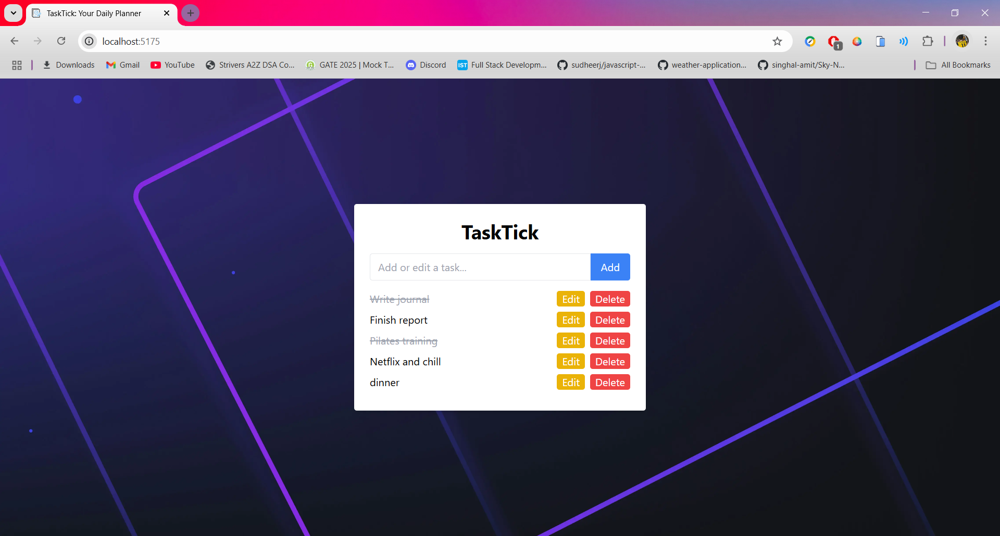
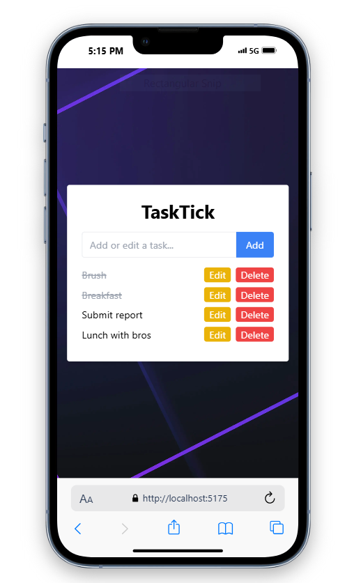

# TaskTick To Do List with React

A simple To-Do List application built with React and Vite.  


---

## App Features

-  Add new tasks
-  Mark tasks as completed
-  Delete tasks
-  Edit tasks
-  Styled with Tailwind CSS

## Tech Stack

- [React](https://reactjs.org/)
- [Vite](https://vitejs.dev/)
- [Tailwind CSS](https://tailwindcss.com/)

## 📸 Screenshots





## Setting Up

### Prerequisites

Make sure you have the following installed:
- [Node.js](https://nodejs.org/) (v16+ recommended)
- [npm](https://www.npmjs.com/)

---

### 1. Clone the Repository

```bash
git clone https://github.com/hardikjha/to-do-list.git
cd to-do-list
```

---

### 2. Install Dependencies

```bash
npm install
```

---

### 3. Run the Development Server

```bash
npm run dev
```


---

## Repo Link

- **GitHub Repo:** [https://github.com/hardikjha/to-do-list](https://github.com/hardikjha/to-do-list)
- Clone and run using steps above

